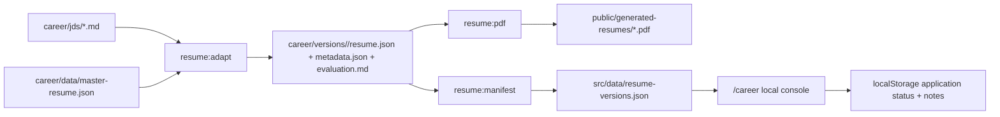

# Local Career Console Design

## Goal

Add a local-first `/career` job application console to the existing resume Web app. The console should help Xiaolei turn collected JDs into tailored resume versions, review evidence and truth warnings, and prepare manual application materials while preserving the current public resume layout and privacy posture.

The first version is a personal local workflow, not a public product. It should not expose JD data, application records, truth warnings, or HR/application notes on `picspin.github.io` by default.

## Non-Goals

- No automated job-board crawling in this phase.
- No automated form submission or one-click application submit.
- No production user accounts, membership system, or multi-user database.
- No replacement of the current resume landing page layout.
- No server-side write API in the static GitHub Pages deployment.

## Privacy Model

The console is local-development first.

- Local development may show `/career` and may load private career artifacts.
- Production builds must not display a `/career` navigation entry.
- Production builds must not bundle detailed local career artifacts by default.
- If a future deployment needs `/career`, it must be protected by real authentication and backed by explicit user-scoped storage.

Implementation should prefer an explicit enable flag such as `VITE_ENABLE_CAREER_CONSOLE=true` in local development. The public build should default to disabled. Data imports for career artifacts should live behind the enabled path so private JSON is not accidentally included in public bundles.

## User Journey

1. Xiaolei saves or pastes a JD into the local `career/jds/` folder.
2. Xiaolei runs the existing generation commands:
   - `npm run resume:adapt -- --jd career/jds/<jd>.md --slug <slug>`
   - `npm run resume:pdf -- --slug <slug>`
   - `npm run resume:manifest`
3. Xiaolei opens the local Web app at `/career`.
4. The console lists generated resume versions and their application status.
5. Xiaolei reviews archetype fit, keywords, evidence matches, adjacent evidence, and truth warnings.
6. Xiaolei confirms or adjusts the resume story manually.
7. The console prepares a manual application pack: tailored PDF, JD summary, HR/LinkedIn/email draft, application link, and follow-up notes.
8. Xiaolei submits manually on the target job portal and updates the local status.

## Information Architecture

### Public Resume

The existing root resume page remains the public-first surface:

- Same visual style, banner, avatar, structured sections, and project thumbnail preview behavior.
- Existing version selector can stay for generated versions when the build intentionally includes them.
- No new public marketing page is required.

### Local Career Console

The `/career` route contains four focused panels.

#### 1. Application Board

Purpose: scan all generated versions and know what needs action.

Fields:

- role label
- archetype
- generated date
- PDF availability
- status
- next action
- application link
- last updated

Statuses:

- `jd_captured`
- `generated`
- `reviewing`
- `ready_to_apply`
- `applied`
- `follow_up`
- `closed`

State is stored in `localStorage` for the MVP. The storage key should be versioned, for example `resumeOps.applications.v1`, so future migration is possible.

#### 2. Evidence Review

Purpose: make the HR-facing adaptation auditable before sending.

Content:

- primary archetype and secondary archetypes
- detected JD keywords
- selected work/projects
- truth warnings from metadata
- evaluation markdown rendered as review text
- direct evidence, adjacent evidence, and evidence gaps

Truth warnings are review-only. They must not appear in external PDF output unless an explicit review mode is added.

#### 3. Manual Apply Pack

Purpose: prepare repeatable manual application materials without auto-submit risk.

Content:

- tailored PDF download
- role-specific resume version metadata
- JD summary
- short HR message draft
- LinkedIn outreach draft
- email body draft
- application URL
- notes

Draft text can be deterministic in the first version. A later AI-assisted polish step can be added after the data boundaries are stable.

#### 4. JD Intake Helper

Purpose: help Xiaolei add new JDs without pretending the browser can safely write repository files.

MVP behavior:

- show the expected file location: `career/jds/<slug>.md`
- show copyable generation commands
- allow drafting a slug locally
- explain which command regenerates the manifest

It does not write files from the browser in phase one.

## Data Flow

Existing resume-ops commands stay the source of generated artifacts.

The first implementation may load `resume-versions.json` for version summaries. If evaluation markdown is needed in the browser, add a generated JSON companion instead of fetching arbitrary local files. That keeps the static app predictable and testable.

## Component Design

Add local-console components without changing the resume presentation components.

Proposed files:

- `src/career/CareerConsole.jsx`
- `src/career/ApplicationBoard.jsx`
- `src/career/EvidenceReview.jsx`
- `src/career/ApplyPack.jsx`
- `src/career/JdIntakeHelper.jsx`
- `src/career/useApplicationState.js`
- `src/career/careerConsoleEnabled.js`

The existing `ResumeSection` and project thumbnail preview behavior stay untouched unless a specific career use case requires reuse.

## Routing

The project currently uses a simple single-page React app. The MVP can avoid a routing library:

- if `window.location.pathname === '/career'` and the console is enabled, render `CareerConsole`
- otherwise render the existing resume page

If the route is disabled and `/career` is opened, render the public resume page or a minimal not-found/disabled state that does not mention private workflow details.

## Error And Empty States

- No generated versions: show the JD intake helper and commands.
- Version has no PDF: show the generation command for that slug.
- Metadata missing: mark the card as needing regeneration.
- Local state parse failure: ignore corrupted local state, start with defaults, and keep the generated artifacts readable.
- Production disabled: do not load private career data.

## Testing

Add tests around pure functions and state handling:

- career console enabled/disabled logic
- application status defaulting and localStorage parsing
- derived application rows from `resume-versions.json`
- PDF missing state

Run:

- `npm run resume:test`
- `npm run build`

Manual verification:

- local `/career` shows generated versions when enabled
- public root resume still renders normally
- production-disabled build does not show the career console entry

## Future Auth Product Boundary

When the workflow is ready to be opened beyond local use, create a separate authenticated product boundary:

- real auth provider
- per-user database storage
- encrypted or access-controlled JD/application data
- server-side generation jobs
- audit trail for generated resume versions
- explicit user confirmation before any application submit

This future version should not rely on a static passcode gate as a privacy mechanism.

## Acceptance Criteria

- `/career` is available for local development when explicitly enabled.
- The public resume page remains visually and structurally intact.
- Generated resume versions can be reviewed in a board-style interface.
- Evidence and truth warnings are visible only inside the local review workflow.
- Manual application pack fields can be saved locally per version.
- No automatic job submission exists in the MVP.
- Production builds default to hiding the career console and avoiding private career data exposure.
